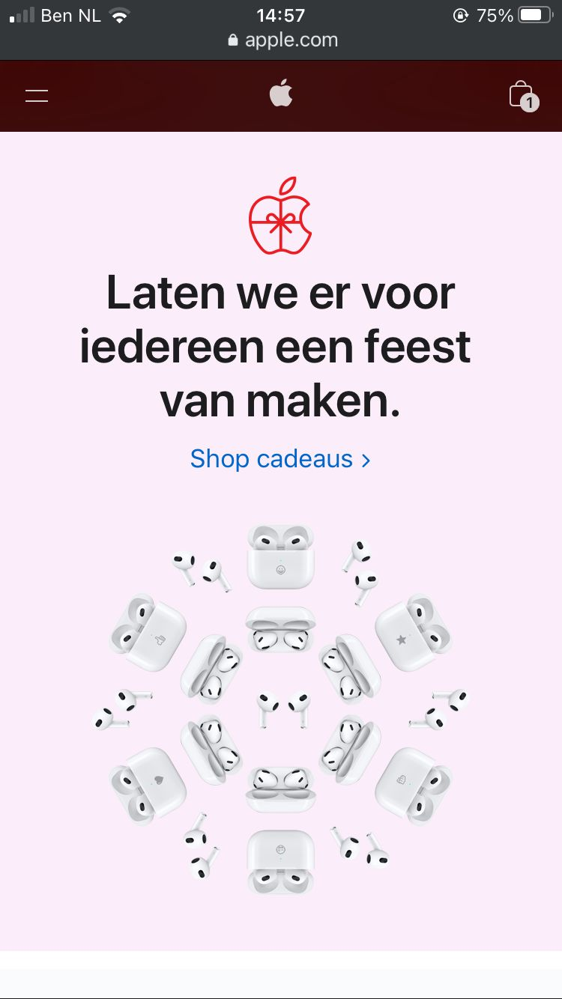

# Procesverslag
Markdown is een simpele manier om HTML te schrijven.  
Markdown cheat cheet: [Hulp bij het schrijven van Markdown](https://github.com/adam-p/markdown-here/wiki/Markdown-Cheatsheet).

Nb. De standaardstructuur en de spartaanse opmaak van de README.md zijn helemaal prima. Het gaat om de inhoud van je procesverslag. Besteedt de tijd voor pracht en praal aan je website.

Nb. Door *open* toe te voegen aan een *details* element kun je deze standaard open zetten. Fijn om dat steeds voor de relevante stuk(ken) te doen.

## Jij

Meer info

### Auteur:
Jack van Vlerken

#### Je startniveau:
Blauw

#### Je focus:
Surface plane
 

## Je website

Meer info

### Je opdracht:
<a href="https://www.apple.com/nl/" alt="Apple website">Apple Website<a>

#### Screenshot(s) van de eerste pagina (small screen): 
Apple Website

#### Screenshot(s) van de tweede pagina (small screen):
Apple website 

 

## Breakdownschets (week 1)

uitwerken na afloop 2e werkgroep

### de hele pagina: 

### dynamisch deel (bijv menu): 

## Voortgang 1 (week 2)

uitwerken voor 1e voortgang

### Stand van zaken
In deze week heb ik mijn HTML zo vanilla mogelijk proberen te maken en daarnaast met css gespeeld voor de positionering van elementen met flexbox en position.
Ik denk dat het opstellen van de HTML heel goed ging. Wat mij heel erg hielp was het maken van een breakdownsheet. Dit is een goeie manier van alles op de website te catagoriseren. Wel twijfel ik nog over mijn sections die ik in de html geplaatst heb.
 

 Verder was het werken met flexbox en position aan het begin weer wat wennen. Dit was de eerste keer in een lange tijd dat ik hiermee gewerkt had, maar na even oefenen (vooral met flexfroggy) kreeg ik het weer te pakken.

### Agenda voor meeting
samen met je groepje opstellen

| Christaan Dirven   | Renee Stapert      | Jack van Vlerken   | 
| ---                | ---                | ---                | 
| Hoe je de CSS      | Wat is de beste    | Hoe maak ik een    | 
| en ik dit          | manier om te       | goed werkend       | 
| gestructueerd      | dit als er tijd is | hamburger menu?    | 
| vorm kan geven,    | beginnen?          | Hoe maak ik van    | 
| hoe moet je        |                    | een button een     | 
| beginnen?          |                    | foto?              | 

### Verslag van meeting

De feedback van de meeting zal ik hieronder in bullet points noemen:
 
 - Begin met HTML, vergeet de styling aan het begin
 - Verdeel CSS in comments. Header styling, main styling, (titel op pagina) styling.
 
 
 - melding = aside maken (class kan weggehaald worden)
 - h1 wel zichbaar maken, maak eerste titel van pagina
 - eerste section in header!
 - alt tags = meer duidelijk, wat het is
 
 laatste ding met buttons
 met details element
 

## Voortgang 2 (week 3)

uitwerken voor 2e voortgang

### Stand van zaken
In deze week ben ik aan mijn CSS en Javascipt begonnen. Wat er goed ging was het positioneren van elementen in CSS en deze de juiste grotes meegeven. Wat ik lastig vond is het maken van het hamburger menu en de animatie die daarbij hoort. 
 
 
 
 
 
 

### Agenda voor meeting
Tijdens de meeting wilde we allemaal meer te weten komen over hoe hamburger menu's werken en de animaties die daarbij horen.

### Verslag van meeting
De feedback van de meeting zal ik hieronder in bullet points noemen:
 
 - Javascript met classlist voor het tonen van het menu
 - 

## Toegankelijkheidstest (week 4)

uitwerken na test in 8e voortgang

### Bevindingen
Lijst met je bevindingen die in de test naar voren kwamen:
 
 - Apple maakt gebruik van een blauwe focus die alleen langs alle knoppen gaat.
 - De kleuren van apple zijn toegankelijk voor alle handicaps, wat betreft zicht.
 - 

#### Apple maakt gebruikt van een blauwe focus.
 

De manier hoe dit opgelost kan worden:
 

#### Titel tweede bevinding. 
Hier korte omschrijving (met indien nodig een afbeelding)

Hier een omschrijving van hoe het opgelost kan worden (met indien nodig een afbeelding)

#### Titel volgende bevinding. 
Hier korte omschrijving (met indien nodig een afbeelding)

Hier een omschrijving van hoe het opgelost kan worden (met indien nodig een afbeelding)

#### Titel nog een bevinding. 
Hier korte omschrijving (met indien nodig een afbeelding)

Hier een omschrijving van hoe het opgelost kan worden (met indien nodig een afbeelding)

## Voortgang 3 (week 4)

uitwerken voor 3e voortgang

### Stand van zaken
In deze week heb ik mijn eerste pagina zo goed als af en ben ik aan mijn tweede pagina haar HTML begonnen.

 
 
 
 

### Agenda voor meeting
Hoe maak je een dropdown in een dropdown?

### Verslag van meeting
hier na afloop snel de uitkomsten van de meeting vastleggen

- punt 1
- punt 2
- nog een punt
- ...

## Eindgesprek (week 5)

uitwerken voor eindgesprek

### Stand van zaken
hier dit ging goed & dit was lastig (neem ook screenshots op van delen van je website en code)

### Screenshot(s)

hier screenshot(s) van je eindresultaat

## Bronnenlijst

continu bijhouden terwijl je werkt

Nb. Wees specifiek ('css-tricks' als bron is bijv. niet specifiek genoeg).

1. bron 1
2. bron 2
3. ...

